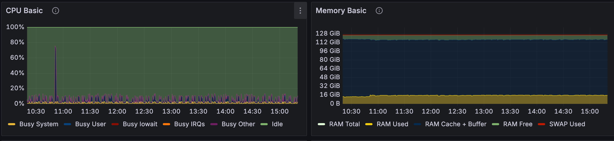
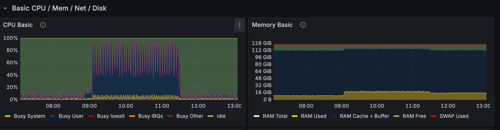

# Benchmark: 12c-128G Bare-metal

## Environment
- Operator version: v1.4.1
- Commit: f0e5c8189983be6ab8632021e530786456097b7a
- OS: ubuntu
- CPU: 12C
- RAM: 128GB
- Disk: 2TB
- WORK_PATH: 
- Prover concurrency: 
- Config summary (pipeline/concurrency/submit batch): 
- cost/month：180$   ===>   cost/min: 0.0042$

## Round 2-1-1-5

concurrency: 3

### Data
| Round ID | Voters | Votes per participant | Total votes | Msg count | DMsg count | Tally duration (s) | Notes | Tally cost |
| --- | --- | --- | --- | --- | --- | --- | --- | --- |
| dora1wsld3ljn5wsntm2k8xc0zg9psdxdlu73eu9wud4au8ndletcft4qfx9vc9 | 25 | 5 | 125 |  |  | 2m 30s |  | 0.013$ |

Fee cost: 0.014 * 11 = 0.16DORA -> 0.2DORA

总成本：0.02$ + 0.2DORA

- CPU: 高点达到73%
- MEM：～16GB

## Round 4-2-2-25

concurrency: 2

### Data
| Round ID | Voters | Votes per participant | Total votes | Msg count | DMsg count | Tally duration (s) | Notes | Tally cost |
| --- | --- | --- | --- | --- | --- | --- | --- | --- |
|dora1yf3qa43zxxv96w6c96c6delntd63mtvkwdj92nka4xn6xqj4433qw2lsmy | 625 | 20 | 12500 |  |  | 160m |  | 0.7$ |

625*25-> 160m + 70m = 230m   ->  0.966 $ -> 1$

Fee cost: 3.26DORA -> 4DORA

总成本：1$ + 4DORA

- CPU: 高点达到95%+
- MEM: 达到20GB

## 对比

原来Tally成本 + gas fee：
- 2-1-1-5: 0.2$
- 4-2-2-25: 7.5$

现在Tally成本 + gas fee：
- 2-1-1-5： 0.02$  (降低了10倍)
- 4-2-2-25：1$     (降低了7.5倍)

设计到机器闲置均摊的话，分别扩大10倍，也就是0.2$和10$

按照DORA=0.1美金的话：
- 2-1-1-5: 2DORA
- 4-2-2-25: 100DORA

变量：
分摊闲置的比例： 目前暂定是10倍
DORA单价：0.1美金
