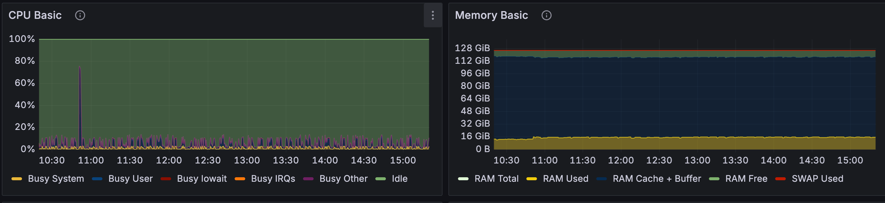
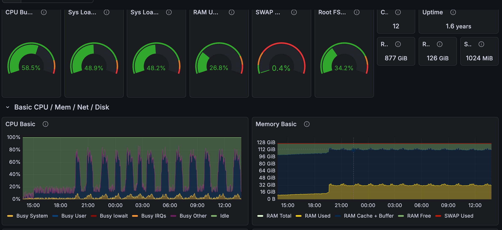

# Benchmark: 12c-128G Bare-metal

## Environment
- Operator version: v1.4.1
- Commit: f0e5c8189983be6ab8632021e530786456097b7a
- OS: ubuntu
- CPU: 12C
- RAM: 128GB
- Disk: 2TB
- WORK_PATH: 
- Prover concurrency: 
- Config summary (pipeline/concurrency/submit batch): 
- cost/month：180$   ===>   cost/min: 0.0042$


## Round 2-1-1-5

concurrency: 3

### Data
| Round ID | Voters | Votes per participant | Total votes | Msg count | DMsg count | Tally duration (s) | Notes | Tally cost |
| --- | --- | --- | --- | --- | --- | --- | --- | --- |
| dora1wsld3ljn5wsntm2k8xc0zg9psdxdlu73eu9wud4au8ndletcft4qfx9vc9 | 25 | 5 | 125 |  |  | 2m 30s |  | 0.013$ |

Fee cost: 0.014 * 11 = 0.16DORA -> 0.2DORA

Total cost：0.02$ + 0.2DORA

- CPU: Peak at 73%
- MEM: ~16GB



## Round 4-2-2-25

concurrency: 2

### Data
| Round ID | Voters | Votes per participant | Total votes | Msg count | DMsg count | Tally duration (s) | Notes | Tally cost |
| --- | --- | --- | --- | --- | --- | --- | --- | --- |
|dora1yf3qa43zxxv96w6c96c6delntd63mtvkwdj92nka4xn6xqj4433qw2lsmy | 625 | 20 | 12500 |  |  | 160m |  | 0.7$ |

625*25-> 160m + 70m = 230m   ->  0.966 $ -> 1$

Fee cost: 3.26DORA -> 4DORA

Total cost：1$ + 4DORA

## Round 6-3-3-125
### Data
| Round ID | Voters | Votes per participant | Total votes | Msg count | DMsg count | Tally duration (s) | Notes | Tally cost |
| --- | --- | --- | --- | --- | --- | --- | --- | --- |
|dora192uyp4zgr7hu7rmmydxggyvur85tz2zc5y7n4rf6xv3zejcrcu4stsjens | 1610 | 20 | 614100 |  |  |  |  |  |

Here is the estimation (assuming 15,625 people participate in the vote, each casting 125 votes):
0. Pre-generation of inputs requires 4 hours

1. The generation time for one MSG proof is:

125163ms -> 130000ms -> 130s

15,625 MSG proofs, so the total time to process MSG proofs is 23.5 days

2. The generation time for one TALLY proof is:

80619ms -> 80s

A total of 15,625 people, so 125 TALLY proofs need to be processed, so the total time is approximately 3 hours

So, in summary, the time required for these three parts is 24 days, and the machine cost is 180*(24/30) = $144

Machine gas cost: 15,625*0.01 + 125*0.01 = 158 DORA (negligible)

So, in summary, the cost is $145

- CPU: Peak reaches 83%+
- MEM: Reaches 32GB



## Comparasion
Original Tally cost + gas fee:

- 2-1-1-5: $0.2
- 4-2-2-25: $7.5

Current Tally cost + gas fee:

- 2-1-1-5: $0.02 (reduced by 10 times)
- 4-2-2-25: $1 (reduced by 7.5 times)

If considering the idle machine sharing, it expands by 10 times, which is $0.2 and $10 respectively.

According to DORA = $0.1:

- 2-1-1-5: 2 DORA
- 4-2-2-25: 100 DORA

Variables:

- Proportion of idle sharing: currently set at 10 times
- DORA unit price: $0.1


  2-1-1-5

  - MSG_TIME_P50 = ceil(ceil(125 / 5) / 3) * 2317.5 = 20.86s
  - TALLY_ALL_TIME_P50 = ceil(5 / 3) * 848 = 1.70s
  - TOTAL_P50 = 22.55s
  - MSG_TIME_P90 = ceil(ceil(125 / 5) / 3) * 2387.2 = 21.48s
  - TALLY_ALL_TIME_P90 = 1.70s
  - TOTAL_P90 = 23.18s

  4-2-2-25

  - MSG_TIME_P50 = ceil(ceil(3125 / 25) / 2) * 6911.5 = 7.26min
  - TALLY_ALL_TIME_P50 = ceil(25 / 2) * 1574.5 = 0.34min
  - TOTAL_P50 = 7.60min
  - MSG_TIME_P90 = ceil(ceil(3125 / 25) / 2) * 7252.9 = 7.62min
  - TALLY_ALL_TIME_P90 = ceil(25 / 2) * 1628.1 = 0.35min
  - TOTAL_P90 = 7.97min

  6-3-3-125

  - MSG_TIME_P50 = ceil(ceil(78125 / 125) / 1) * 23032 = 239.92min
  - TALLY_ALL_TIME_P50 = ceil(125 / 1) * 10118 = 21.08min
  - TOTAL_P50 = 261.00min
  - MSG_TIME_P90 = ceil(ceil(78125 / 125) / 1) * 23744 = 247.33min
  - TALLY_ALL_TIME_P90 = ceil(125 / 1) * 10527 = 21.93min
  - TOTAL_P90 = 269.26min


 1. General formula

ACTUAL_TOTAL_TIME(m, u) =
  MSG_ROUNDS(m) * max(T_msg_proof, T_msg_submit)
  + GATE_TIME
  + TALLY_ROUNDS(u) * max(T_tally_proof, T_tally_submit)
  + FINALIZE_TIME

  Here:

  - m = number of messages
  - u = actual number of participants
  - T_msg_proof = time for one MSG proof generation batch
  - T_msg_submit = on-chain submission interval for one MSG batch
  - T_tally_proof = time for one TALLY proof generation batch
  - T_tally_submit = on-chain submission interval for one TALLY batch
  - GATE_TIME = waiting time from the end of MSG processing to entering the TALLY phase
  - FINALIZE_TIME = tail time from the last TALLY batch to round completion

  2. Number of MSG rounds

  MSG_PROOF_COUNT(m) = ceil(m / MSG_PER_PROOF)
  MSG_ROUNDS(m) = ceil(MSG_PROOF_COUNT(m) / MSG_PROOFS_PER_GENERATION_BATCH)

  Combined form:

  MSG_ROUNDS(m) = ceil(ceil(m / MSG_PER_PROOF) / MSG_PROOFS_PER_GENERATION_BATCH)

  3. Number of TALLY rounds

  TALLY_PROOF_COUNT(u) = ceil(u / TALLY_USERS_PER_PROOF)
  TALLY_ROUNDS(u) = ceil(TALLY_PROOF_COUNT(u) / TALLY_PROOFS_PER_GENERATION_BATCH)

  Combined form:

  TALLY_ROUNDS(u) = ceil(ceil(u / TALLY_USERS_PER_PROOF) / TALLY_PROOFS_PER_GENERATION_BATCH)

  4. If written using the parameters of a specific circuit

  For example, 6-3-3-125:

  - MSG_PER_PROOF = 125
  - MSG_PROOFS_PER_GENERATION_BATCH = 1
  - TALLY_USERS_PER_PROOF = 125
  - TALLY_PROOFS_PER_GENERATION_BATCH = 1

  Therefore:

  MSG_ROUNDS(m) = ceil(ceil(m / 125) / 1)
  TALLY_ROUNDS(u) = ceil(ceil(u / 125) / 1)

  Final form:

ACTUAL_TOTAL_TIME_6-3-3-125(m, u) =
  ceil(ceil(m / 125) / 1) * max(T_msg_proof, T_msg_submit)
  + GATE_TIME
  + ceil(ceil(u / 125) / 1) * max(T_tally_proof, T_tally_submit)
  + FINALIZE_TIME

  5. The form of the actual substituted values in the current benchmark

  Using 6-3-3-125 as an example:

ACTUAL_TOTAL_TIME_P50(m, u) =
  ceil(ceil(m / 125) / 1) * max(23032, 22978.5)
  + 7877
  + ceil(ceil(u / 125) / 1) * max(10118, 9893.5)
  + 11968

  Because max(23032, 22978.5) = 23032
  max(10118, 9893.5) = 10118

  So it can be simplified to:

ACTUAL_TOTAL_TIME_P50(m, u) =
  ceil(m / 125) * 23032
  + 7877
  + ceil(u / 125) * 10118
  + 11968

  For P90:

ACTUAL_TOTAL_TIME_P90(m, u) =
  ceil(m / 125) * 28615
  + 7877
  + ceil(u / 125) * 10527
  + 11968

  6. General simplified form

  So you can remember it as this most practical form:

ACTUAL_TOTAL_TIME =
  MSG_ROUNDS * max(MSG_PROOF_TIME, MSG_SUBMIT_INTERVAL)
  + GATE_TIME
  + TALLY_ROUNDS * max(TALLY_PROOF_TIME, TALLY_SUBMIT_INTERVAL)
  + FINALIZE_TIME


 Unified template:

ACTUAL_TOTAL_TIME(m, u) =
  ceil(ceil(m / MSG_PER_PROOF) / MSG_PROOFS_PER_GENERATION_BATCH) * max(T_msg_proof, T_msg_submit)
  + GATE_TIME
  + ceil(ceil(u / TALLY_USERS_PER_PROOF) / TALLY_PROOFS_PER_GENERATION_BATCH) * max(T_tally_proof, T_tally_submit)
  + FINALIZE_TIME

  Here:

  - m = number of messages
  - u = actual number of participants

  ———

  ## 1. 2-1-1-5

  Parameters:

  - MSG_PER_PROOF = 5
  - MSG_PROOFS_PER_GENERATION_BATCH = 3
  - TALLY_USERS_PER_PROOF = 5
  - TALLY_PROOFS_PER_GENERATION_BATCH = 3

  Current benchmark:

  - T_msg_proof P50 = 2317.5
  - T_msg_submit P50 = 7205.5
  - T_tally_proof P50 = 848
  - T_tally_submit P50 = 6802
  - GATE_TIME = 8267
  - FINALIZE_TIME = 6828
  - T_msg_proof P90 = 2387.2
  - T_msg_submit P90 = 12279.6
  - T_tally_proof P90 = 848
  - T_tally_submit P90 = 6802

  ### P50

ACTUAL_TOTAL_TIME_2-1-1-5_P50(m, u) =
  ceil(ceil(m / 5) / 3) * max(2317.5, 7205.5)
  + 8267
  + ceil(ceil(u / 5) / 3) * max(848, 6802)
  + 6828

  Simplified:

ACTUAL_TOTAL_TIME_2-1-1-5_P50(m, u) =
  ceil(ceil(m / 5) / 3) * 7205.5
  + 8267
  + ceil(ceil(u / 5) / 3) * 6802
  + 6828

  ### P90

ACTUAL_TOTAL_TIME_2-1-1-5_P90(m, u) =
  ceil(ceil(m / 5) / 3) * max(2387.2, 12279.6)
  + 8267
  + ceil(ceil(u / 5) / 3) * max(848, 6802)
  + 6828

  Simplified:

ACTUAL_TOTAL_TIME_2-1-1-5_P90(m, u) =
  ceil(ceil(m / 5) / 3) * 12279.6
  + 8267
  + ceil(ceil(u / 5) / 3) * 6802
  + 6828

  ———

  ## 2. 4-2-2-25

  Parameters:

  - MSG_PER_PROOF = 25
  - MSG_PROOFS_PER_GENERATION_BATCH = 2
  - TALLY_USERS_PER_PROOF = 25
  - TALLY_PROOFS_PER_GENERATION_BATCH = 2

  Current benchmark:

  - T_msg_proof P50 = 6911.5
  - T_msg_submit P50 = 7029.5
  - T_tally_proof P50 = 1574.5
  - T_tally_submit P50 = 6826
  - GATE_TIME = 13228
  - FINALIZE_TIME = 7197
  - T_msg_proof P90 = 7252.9
  - T_msg_submit P90 = 12552.7
  - T_tally_proof P90 = 1628.1
  - T_tally_submit P90 = 11698

### P50

ACTUAL_TOTAL_TIME_4-2-2-25_P50(m, u) =
  ceil(ceil(m / 25) / 2) * max(6911.5, 7029.5)
  + 13228
  + ceil(ceil(u / 25) / 2) * max(1574.5, 6826)
  + 7197

  Simplified:

ACTUAL_TOTAL_TIME_4-2-2-25_P50(m, u) =
  ceil(ceil(m / 25) / 2) * 7029.5
  + 13228
  + ceil(ceil(u / 25) / 2) * 6826
  + 7197

  ### P90

ACTUAL_TOTAL_TIME_4-2-2-25_P90(m, u) =
  ceil(ceil(m / 25) / 2) * max(7252.9, 12552.7)
  + 13228
  + ceil(ceil(u / 25) / 2) * max(1628.1, 11698)
  + 7197

  Simplified:

ACTUAL_TOTAL_TIME_4-2-2-25_P90(m, u) =
  ceil(ceil(m / 25) / 2) * 12552.7
  + 13228
  + ceil(ceil(u / 25) / 2) * 11698
  + 7197

  ———

## 3. 6-3-3-125

  Parameters:

  - MSG_PER_PROOF = 125
  - MSG_PROOFS_PER_GENERATION_BATCH = 1
  - TALLY_USERS_PER_PROOF = 125
  - TALLY_PROOFS_PER_GENERATION_BATCH = 1

  Current benchmark:

  - T_msg_proof P50 = 23032
  - T_msg_submit P50 = 22978.5
  - T_tally_proof P50 = 10118
  - T_tally_submit P50 = 9893.5
  - GATE_TIME = 7877
  - FINALIZE_TIME = 11968
  - T_msg_proof P90 = 23744
  - T_msg_submit P90 = 28615
  - T_tally_proof P90 = 10527
  - T_tally_submit P90 = 10301.6

  #### P50

  ACTUAL_TOTAL_TIME_6-3-3-125_P50(m, u)
  =
  ceil(ceil(m / 125) / 1) * max(23032, 22978.5)
  + 7877
  + ceil(ceil(u / 125) / 1) * max(10118, 9893.5)
  + 11968

  Simplified:

ACTUAL_TOTAL_TIME_6-3-3-125_P50(m, u) =
  ceil(m / 125) * 23032
  + 7877
  + ceil(u / 125) * 10118
  + 11968

  ### P90

ACTUAL_TOTAL_TIME_6-3-3-125_P90(m, u) =
  ceil(ceil(m / 125) / 1) * max(23744, 28615)
  + 7877
  + ceil(ceil(u / 125) / 1) * max(10527, 10301.6)
  + 11968

  Simplified:

ACTUAL_TOTAL_TIME_6-3-3-125_P90(m, u) =
  ceil(m / 125) * 28615
  + 7877
  + ceil(u / 125) * 10527
  + 11968

  ———

  ## Simplified formulas

  ### 2-1-1-5

  P50: ceil(ceil(m / 5) / 3) * 7205.5 + 8267 + ceil(ceil(u / 5) / 3) * 6802 + 6828
  P90: ceil(ceil(m / 5) / 3) * 12279.6 + 8267 + ceil(ceil(u / 5) / 3) * 6802 + 6828

  ### 4-2-2-25

  P50: ceil(ceil(m / 25) / 2) * 7029.5 + 13228 + ceil(ceil(u / 25) / 2) * 6826 + 7197
  P90: ceil(ceil(m / 25) / 2) * 12552.7 + 13228 + ceil(ceil(u / 25) / 2) * 11698 + 7197

  ### 6-3-3-125

  P50: ceil(m / 125) * 23032 + 7877 + ceil(u / 125) * 10118 + 11968
  P90: ceil(m / 125) * 28615 + 7877 + ceil(u / 125) * 10527 + 11968


Assumptions

  - Fee for each processed MSG batch transaction: 0.01 DORA
  - Fee for each processed TALLY batch transaction: 0.01 DORA
  - For now, only the following are included:
      - MSG processing transactions
      - TALLY processing transactions
  - Not included:
      - stopProcessing
      - stopTally
      - claim
      - deactivate

  General formula

  Let:

  - m = actual vote count / number of messages
  - u = actual number of participants
  - f = 0.01 DORA = fee per processing transaction

  Then:

  MSG_GAS(m) = MSG_TX_COUNT(m) * f
  TALLY_GAS(u) = TALLY_TX_COUNT(u) * f
  TOTAL_GAS(m, u) = (MSG_TX_COUNT(m) + TALLY_TX_COUNT(u)) * f

  ———

  ## 1. 2-1-1-5

  Current operator submission granularity:

  - Each MSG proof processes 5 messages
  - Each MSG transaction submits 3 proofs
  - Each TALLY proof processes 5 users
  - Each TALLY transaction submits 3 proofs

  Therefore:

  MSG_TX_COUNT_2-1-1-5(m) = ceil(ceil(m / 5) / 3)
  TALLY_TX_COUNT_2-1-1-5(u) = ceil(ceil(u / 5) / 3)

  TOTAL_GAS_2-1-1-5(m, u)
  = (ceil(ceil(m / 5) / 3) + ceil(ceil(u / 5) / 3)) * 0.01

  ———

  ## 2. 4-2-2-25

  Current operator submission granularity:

  - Each MSG proof processes 25 messages
  - Each MSG transaction submits 2 proofs
  - Each TALLY proof processes 25 users
  - Each TALLY transaction submits 2 proofs

  Therefore:

  MSG_TX_COUNT_4-2-2-25(m) = ceil(ceil(m / 25) / 2)
  TALLY_TX_COUNT_4-2-2-25(u) = ceil(ceil(u / 25) / 2)

  TOTAL_GAS_4-2-2-25(m, u)
  = (ceil(ceil(m / 25) / 2) + ceil(ceil(u / 25) / 2)) * 0.01

  ———

  ## 3. 6-3-3-125

  Current operator submission granularity:

  - Each MSG proof processes 125 messages
  - Each MSG transaction submits 1 proof
  - Each TALLY proof processes 125 users
  - Each TALLY transaction submits 1 proof

  Therefore:

  MSG_TX_COUNT_6-3-3-125(m) = ceil(m / 125)
  TALLY_TX_COUNT_6-3-3-125(u) = ceil(u / 125)

  TOTAL_GAS_6-3-3-125(m, u)
  = (ceil(m / 125) + ceil(u / 125)) * 0.01

  ———

  ## 4. 9-4-3-125

  Under the current operator configuration, the default concurrency for 9-4-3-125 is 1, so it is calculated here as 1 proof / tx.

  - Each MSG proof processes 125 messages
  - Each MSG transaction submits 1 proof
  - Each TALLY proof processes 625 users
  - Each TALLY transaction submits 1 proof

  Therefore:

  MSG_TX_COUNT_9-4-3-125(m) = ceil(m / 125)
  TALLY_TX_COUNT_9-4-3-125(u) = ceil(u / 625)

  TOTAL_GAS_9-4-3-125(m, u)
  = (ceil(m / 125) + ceil(u / 625)) * 0.01


2-1-1-5:
where u = 25
total cost = ((ceil(ceil(m / 5) / 3) * 12279.6 + 8267 + ceil(ceil(u / 5) / 3) * 6802 + 6828) /1000 / 60 * 0.0042) USD + ((ceil(ceil(m / 5) / 3) + ceil(ceil(u / 5) / 3)) * 0.01)DORA

4-2-2-25:
where u = 625
total cost = ((ceil(ceil(m / 25) / 2) * 12552.7 + 13228 + ceil(ceil(u / 25) / 2) * 11698 + 7197) / 1000 / 60 * 0.0042) USD + ((ceil(ceil(m / 25) / 2) + ceil(ceil(u / 25) / 2)) * 0.01) DORA

6-3-3-125
where u = 15625
total cost = ((ceil(m / 125) * 28615 + 7877 + ceil(u / 125) * 10527 + 11968) / 1000 / 60 * 0.0042) USD + ((ceil(m / 125) + ceil(u / 125)) * 0.01) DORA


  ### 2-1-1-5

  ServerCostUSD
  = ((ceil(ceil(m / 5) / 3) * 12279.6 + 8267 + ceil(ceil(25 / 5) / 3) * 6802 + 6828) / 1000 / 60) * 0.0042

  GasCostDORA
  = (ceil(ceil(m / 5) / 3) + ceil(ceil(25 / 5) / 3)) * 0.01

  ### 4-2-2-25

  ServerCostUSD
  = ((ceil(ceil(m / 25) / 2) * 12552.7 + 13228 + ceil(ceil(625 / 25) / 2) * 11698 + 7197) / 1000 / 60) * 0.0042

  GasCostDORA
  = (ceil(ceil(m / 25) / 2) + ceil(ceil(625 / 25) / 2)) * 0.01

  ### 6-3-3-125

  ServerCostUSD
  = ((ceil(m / 125) * 28615 + 7877 + ceil(15625 / 125) * 10527 + 11968) / 1000 / 60) * 0.0042

  GasCostDORA
  = (ceil(m / 125) + ceil(15625 / 125)) * 0.01


((m / 25) / 2) * 12552.7

20000/25/2  * 12552  5000

20000/ 125 * 28615  = 4578


  | Circuit | Max participants | Total votes | MSG Cost P50 | MSG Cost P90 | TALLY Cost P50 | TALLY Cost P90 |
  | --- | ---: | ---: | ---: | ---: | ---: | ---: |
  | 2-1-1-5 | 25 | 125 | 0.00454 USD | 0.00774 USD | 0.00095 USD | 0.00095 USD |
  | 4-2-2-25 | 625 | 3125 | 0.03100 USD | 0.05536 USD | 0.00621 USD | 0.01065 USD |
  | 6-3-3-125 | 15625 | 78125 | 1.00765 USD | 1.25191 USD | 0.08853 USD | 0.09211 USD |


  | Circuit | Max participants | Total votes | Per-vote P50 | Per-vote P90 |
  | --- | ---: | ---: | ---: | ---: |
  | 2-1-1-5 | 25 | 125 | 0.00003632 USD | 0.00006189 USD |
  | 4-2-2-25 | 625 | 3125 | 0.00000992 USD | 0.00001771 USD |
  | 6-3-3-125 | 15625 | 78125 | 0.00001290 USD | 0.00001602 USD |


**Each participant casts 5 votes:**

Under P90 assumptions:
  | Circuit | Max participants | Total votes | Server Cost | Gas Cost |
  | --- | ---: | ---: | ---: | ---: |
  | 2-1-1-5 | 25 | 125 | 0.00975 USD | 0.11 DORA |
  | 4-2-2-25 | 625 | 3125 | 0.06743 USD | 0.76 DORA |
  | 6-3-3-125 | 15625 | 78125 | 1.34541 USD | 7.50 DORA |


Under P50 assumptions:
  | Circuit | Max participants | Total votes | Server Cost P50 | Gas Cost |
  | --- | ---: | ---: | ---: | ---: |
  | 2-1-1-5 | 25 | 125 | 0.00655 USD | 0.11 DORA |
  | 4-2-2-25 | 625 | 3125 | 0.03862 USD | 0.76 DORA |
  | 6-3-3-125 | 15625 | 78125 | 1.09757 USD | 7.50 DORA |


Delayed time：

  | Circuit | Max participants | Total votes | P50 execution time | P90 execution time |
  | --- | ---: | ---: | ---: | ---: |
  | 2-1-1-5 | 25 | 125 | 1.56 min | 2.32 min |
  | 4-2-2-25 | 625 | 3125 | 9.19 min | 16.06 min |
  | 6-3-3-125 | 15625 | 78125 | 261.33 min | 320.33 min |


```json
{
    "machineTypes": {
        "12c-128G-Bare-metal": {
            "currentTallyCostUsd": {
                "2-1-1-5": 0.02,
                "4-2-2-25": 0.5,
                "6-3-3-125": 1
            },
            "idleSharingMultiplier": 10
        }
    }
}
```


  ———

  ## P90 base parameter table

  | Circuit | per-vote time | per-vote cost | tally time | tally cost | fixed overhead time | fixed overhead cost |
  | --- | ---: | ---: | ---: | ---: | ---: | ---: |
  | 2-1-1-5 | 0.8841 s | 0.00006189 USD | 0.2267 min | 0.00095228 USD | 0.2516 min | 0.00105665 USD |
  | 4-2-2-25 | 0.2531 s | 0.00001771 USD | 2.5346 min | 0.01064518 USD | 0.3404 min | 0.00142975 USD |
  | 6-3-3-125 | 0.2289 s | 0.00001602 USD | 21.9313 min | 0.09211125 USD | 0.3308 min | 0.00138915 USD |

  ———


  | Circuit | per-vote time | per-vote cost | tally time | tally cost | fixed overhead time | fixed overhead cost |
  | --- | ---: | ---: | ---: | ---: | ---: | ---: |
  | 2-1-1-5 | 0.8841 s | 0.00006189 USD | 0.2267 min | 0.00095228 USD | 0.2516 min | 0.00105665 USD |
  | 2-1-1-25 | 0.2454 s | 0.00001718 USD | 0.3442 min | 0.00144581 USD | 0.3361 min | 0.00141162 USD |
  | 4-2-2-25 | 0.2531 s | 0.00001771 USD | 2.5346 min | 0.01064518 USD | 0.3404 min | 0.00142975 USD |
  | 6-3-3-125 | 0.2289 s | 0.00001602 USD | 21.9313 min | 0.09211125 USD | 0.3308 min | 0.00138915 USD |
  | 9-4-3-125 | 0.2776 s | 0.00001943 USD | 3585.7083 min | 15.05997500 USD | 0.2551 min | 0.00107156 USD |


  ### 2-1-1-5

  - Total Server Time(v) ≈ 0.8841s * v + 0.2267min + 0.2516min
  - Total Server Cost(v) ≈ (0.00006189 * v + 0.00095228 + 0.00105665) * 10   USD

  ### 2-1-1-25
  - Total Server Time(v) ≈  0.2454s * m + 0.3442min + 0.3361min
  - Total Server Cost(v) ≈ 

  ### 4-2-2-25

  - Total Server Time(v) ≈ 0.2531s * v + 2.5346min + 0.3404min
  - Total Server Cost(v) ≈ (0.00001771 * v + 0.01064518 + 0.00142975) * 10   USD

  ### 6-3-3-125

  - Total Server Time(v) ≈ 0.2289s * v + 21.9313min + 0.3308min
  - Total Server Cost(v) ≈ (0.00001602 * v + 0.09211125 + 0.00138915) * 10   USD

  ### 9-4-3-125
  - Total Server Time(v) = 0.2776s * m + 3585.7083min + 0.2551min
  - Total Server Cost(v) = 


### GAS 成本估算
按照每个规模对应的最大人数来计算tally fixed gas成本
  | Circuit | MSG Gas / vote | TALLY Fixed Gas |
  | --- | ---: | ---: |
  | 2-1-1-5 | 0.00072 DORA / vote | 0.02 DORA |
  | 4-2-2-25 | 0.0002016 DORA / vote | 0.13 DORA |
  | 6-3-3-125 | 0.00008 DORA / vote | 1.25 DORA |
  | 9-4-3-125 | 0.00008 DORA / vote | 31.25 DORA |


## 不同电路规模delya时间/成本汇总
> server cost + operator gas fee

2-1-1-5:
Base fee:
(0.00095228 + 0.00105665) * 10USD + 0.02 * 0.005 USD = 0.0201893


- 2-1-1-25:
  - Base fee: (0.00144581 + 0.00141162) * 10 USD + 0.02 * 0.005 USD = 0.0286743
  - Vote fee: (0.00001718 * 1) * 10USD + (0.00072 * 1) * 0.005 USD = 0.0001754 USD
- 4-2-2-25:
  - Base fee:
(0.01064518 + 0.00142975) * 10 USD + 0.13 * 0.005 USD = 0.1213993 USD
  - Vote fee
(0.00001771 * 1 ) * 10USD + (0.0002016 * 1) * 0.005 USD = 0.000178108 USD
- 6-3-3-125:
  - Base fee:
  (0.09211125 + 0.00138915) * 10 USD + 1.25 * 0.005 USD = 0.941254 USD
  - Vote fee:
  0.00001602 * 1 * 10USD + 0.00008 * 1 * 0.005USD = 0.0001606 USD
- 9-4-3-125:
  - Base fee: (15.05997500 + 0.00107156) * 10 USD + 31.25 * 0.005 USD = 150.77 USD
  - Vote fee: 0.00001943 * 1 * 10 USD + 0.00008 * 1 * 0.005USD = 0.0001947 USD


The actual calculated vote fee is: 0.00018 USD
Under a 10% markup, the standard vote fee would be: 0.0002 USD
Actual pricing: 0.0003 USD